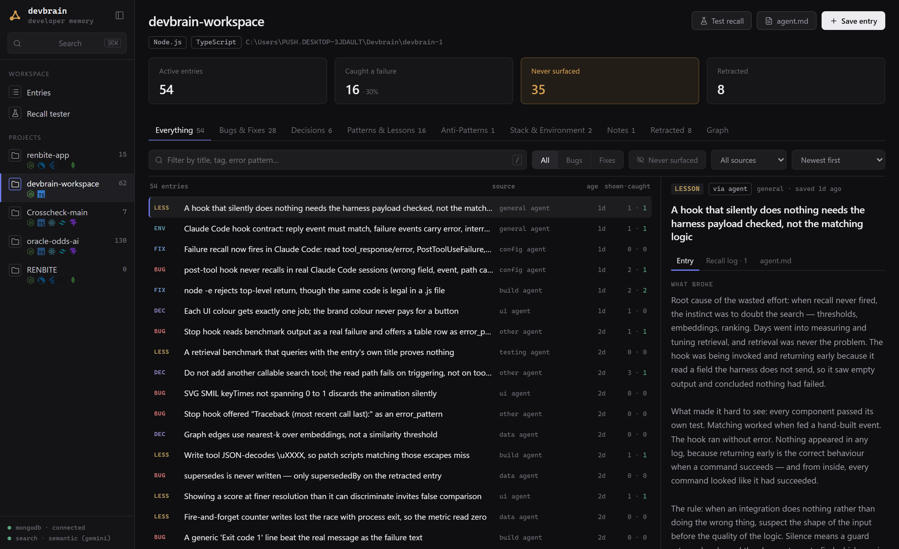
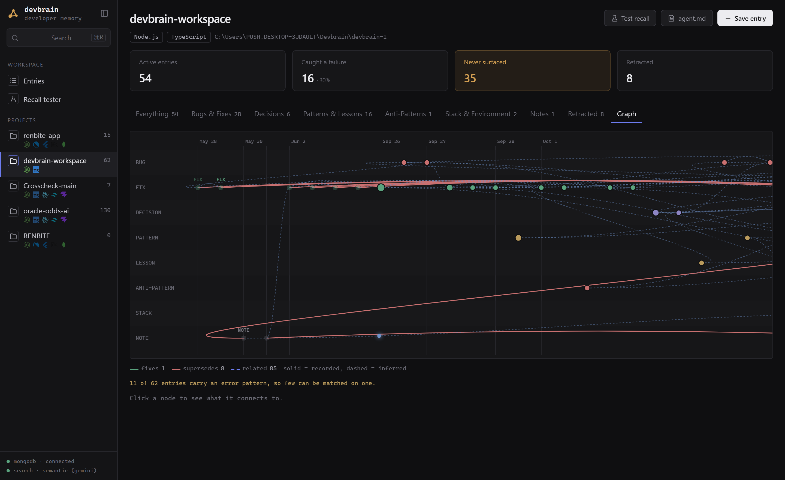

# DevBrain

Persistent developer memory for you and your AI agents. Your coding agent writes down what it fixes and decides as it works, and reads it back before the next task — so it already knows what broke before, what was decided, and why. DevBrain notices when something worth keeping happened, stores it, and ranks it back; it needs no AI service of its own.

**🚀 Live demo:** **https://devbrain-oujuoveyvq-uc.a.run.app** — dashboard and the agent at `POST /agent`, on **Gemini 2.5 Flash (Vertex AI)** + **MongoDB Atlas** on **Google Cloud Run**.

> The hosted instance is an older build than this repo and its database is not currently reachable, so parts of it answer and parts do not. Run it locally for the current thing — `npm install` through `devbrain setup` below takes a couple of minutes and needs no cloud account.

```bash
# Ask the deployed agent (Gemini 2.5 Flash on Vertex AI) anything in your team's memory:
curl -X POST https://devbrain-oujuoveyvq-uc.a.run.app/agent \
  -H "Content-Type: application/json" \
  -d '{"query":"any fixes for mobile safe-area overlap?"}'
```



---

## How it works

**The agent writes; DevBrain stores.** The coding agent that did the work already holds the whole story in its context — the error, the dead ends, why the fix works. It states that better than any second model reading a transcript afterwards, so it writes every entry, through the `save_entry` MCP tool or `devbrain note`. What agents lacked was a trigger they could not forget, so DevBrain supplies the triggers, mechanically and without a model:

- **Session start** — the project's memory is put into the agent's context.
- **When you describe a problem** — your own words are searched against memory before the agent starts work. Most debugging begins with a sentence, not a stack trace, and that sentence is the best description of the problem anyone writes all session.
- **When a command fails** — the error is matched against what is stored and a hit is handed over unasked, in the moment the agent would otherwise press on. Installed for every tool, not just shells: a production error is usually found by *reading* it — a log query, a database probe — and those are often not shell commands at all.
- **After each turn** — DevBrain reads the transcript locally. If the turn resolved an error or made a stated decision and nothing was saved, it asks the agent once, showing it the error text and the files involved. The agent writes the entry; routine turns cost nothing.
- **Past work** — commits and sessions from before DevBrain was installed are handed over with `devbrain backfill`, in batches the agent reads and saves from.

Writing was never the hard half. Three of those five triggers exist to make memory get *read*, because an agent absorbed in a bug does not stop to search — and a memory nothing reads back is a diary.

The memory compounds. An entry retrieved across multiple projects gets flagged as a cross-project pattern and surfaces in every future context load. Confidence rises only on independent evidence — the same knowledge recurring in a second project, or a person confirming it — never just because DevBrain read it back.

### The dashboard

`--serve` puts the whole store in a browser at **http://localhost:8080**:

- **Entries** — a list beside a detail pane, so reading one entry never loses your place in the list. Each row carries its type, category, age, how it was captured, and how often it was shown against how often it actually caught a failure.
- **Four counts across the top** — active, caught a failure, never surfaced, retracted. Side by side on purpose: "62 entries" is only good news next to "10 have ever caught anything".
- **Graph** — the same entries drawn, time left to right, a lane per type. A bug and the fix that closed it are linked, so "where did this get fixed" is a place on the picture. Recorded links are solid; inferred ones (same session, same error, nearest in meaning) are dashed, because they are a guess.
- **Recall tester** — paste a failure, see exactly what an agent would be handed. It is the only way to check the half that matters, and it says plainly when the answer is nothing.



### Shared Knowledge Across Codebases
Every registered project writes to one knowledge base — local by default, or a shared MongoDB Atlas cluster when `MONGODB_URI` is set. Across your own projects this works either way; a *team* sharing collective memory is what pointing several machines at the same Atlas database gives you:
- **The Team Feed**: The web dashboard renders a shared activity timeline of the latest fixes, decisions, and patterns across all registered codebases, each labeled with its project and stack.
- **CLI sibling alerts**: When you load context in the CLI, DevBrain surfaces the most recent entries from your *other* projects (e.g. surfacing a layout fix saved in a mobile repo while you work on a web frontend), so solutions cross repository boundaries instead of being re-derived.


## Install

```bash
git clone https://github.com/pushthev1be/devbrain.git
cd devbrain
npm install --ignore-scripts
npm run build          # builds core, then cli and mcp
cd packages/cli && npm link
```

Then run the setup wizard:

```bash
devbrain setup
```

It asks where to keep your memory, offers optional semantic search, and sets up the current project (the same as `devbrain init`). Settings go to `~/.devbrain/.env`; re-run it anytime.

### Storage: local by default

**No database required.** With `MONGODB_URI` unset, DevBrain stores everything in `~/.devbrain/db.json` and ranks embeddings in memory. Saving, searching, context and the agent hooks all work with nothing provisioned.

Set `MONGODB_URI` when you want to:
- share one knowledge base across a team or several machines
- use **Atlas Vector Search** server-side instead of in-memory ranking (create a 3072-dim cosine index named `embedding_index` on the `entries` collection)

Switching is just the env var — the two backends are interchangeable at runtime.

### Gemini credentials (optional)

Nothing in DevBrain needs a model: the agent writes every entry, and search, context and duplicate detection match keywords. Gemini is an upgrade — embeddings make search match by meaning, and it adds root-cause archetypes and summarised context sections. The hosted agent at `/agent` does need it. DevBrain runs Gemini on one of two backends: **Vertex AI** (Google Cloud) for hosted/production, or the **Gemini Developer API** (AI Studio) for local dev.

For local dev, get a free key at [aistudio.google.com](https://aistudio.google.com):

```bash
mkdir -p ~/.devbrain
echo "GEMINI_API_KEY=your_key_here" > ~/.devbrain/.env
```

To run on Google Cloud AI instead, see [Running on Vertex AI](#running-on-vertex-ai-google-cloud) below. To try DevBrain with no credentials at all, see [Mock Mode](#running-offline-mock-mode).

### Running Offline (Mock Mode)

To run DevBrain completely offline for development, testing, or recording demonstrations without requiring an active Gemini API key, enable **Mock Mode** in your environment:
- **Bash / Git Bash**: `export DEVBRAIN_MOCK="true"`
- **PowerShell**: `$env:DEVBRAIN_MOCK="true"`

This intercepts Gemini API calls and returns pre-computed high-fidelity synthetic vectors and technical memory mockups.

### Connect to your AI Agent or MCP Client

To run the MCP server locally using standard stdio transport, add this server block to your client configurations:

```json
{
  "mcpServers": {
    "devbrain": {
      "type": "stdio",
      "command": "node",
      "args": ["/absolute/path/to/devbrain/packages/mcp/dist/index.js"]
    }
  }
}
```

For hosted developer teams, DevBrain is optimized for cloud deployment and supports Streamable HTTP (SSE) transport natively.

---

## Running on Vertex AI (Google Cloud)

In production DevBrain runs Gemini — both reasoning (`gemini-2.5-flash`) and embeddings (`gemini-embedding-001`, 3072-dim) — on **Vertex AI**, Google Cloud's managed AI platform. The ADK agent ([`packages/mcp/src/agent.ts`](packages/mcp/src/agent.ts)) and the core extraction/embedding pipeline ([`packages/core/src/gemini.ts`](packages/core/src/gemini.ts)) both honor the same backend switch, so a single set of environment variables moves the whole system onto Google Cloud AI.

**1. Enable the API and grant access** (one-time, on a billing-enabled project):

```bash
gcloud services enable aiplatform.googleapis.com --project=YOUR_PROJECT
# Grant the runtime identity (Cloud Run service account) access to Vertex AI:
gcloud projects add-iam-policy-binding YOUR_PROJECT \
  --member="serviceAccount:YOUR_RUNTIME_SA@YOUR_PROJECT.iam.gserviceaccount.com" \
  --role="roles/aiplatform.user"
```

**2. Set the backend env vars** (on Cloud Run, or locally):

```bash
GOOGLE_GENAI_USE_VERTEXAI=true
GOOGLE_CLOUD_PROJECT=YOUR_PROJECT
GOOGLE_CLOUD_LOCATION=global   # AI-Studio-origin projects serve Gemini chat via `global`
MONGODB_URI=...                # your Atlas connection string
```

> **Model/location note:** `gemini-2.5-flash` is the default chat model and is served from the `global` location on Vertex (regional locations like `us-central1` also work for embeddings). On projects created through Google AI Studio (`gen-lang-client-*`), `gemini-2.0-flash` is unavailable on Vertex — use `gemini-2.5-flash`. Override with `GEMINI_MODEL` if needed.

**3. Authentication is automatic.** On Cloud Run, Gemini calls authenticate via the attached service account through Application Default Credentials (ADC) — no API key or key file. To test the Vertex path locally:

```bash
gcloud auth application-default login
```

When `GOOGLE_GENAI_USE_VERTEXAI` is unset or `false`, DevBrain falls back to the Gemini Developer API using `GEMINI_API_KEY` — convenient for offline/local work. Either way the model IDs and 3072-dim embedding schema are identical, so your MongoDB Atlas Vector Search index is unchanged across backends.

> Deploy: `gcloud run deploy` builds the included [`Dockerfile`](Dockerfile) and serves the MCP SSE endpoint on `:8080`. Set the four env vars above on the service.

---

## Starting a new project

```bash
cd my-project
devbrain init
```

`init` registers the project, detects the tech stack (reading the root *and* one level below it, so an app-and-server repo reports both halves rather than nothing), installs the Claude Code hooks into `.claude/settings.local.json` (local, so teammates without DevBrain are unaffected), and writes `DEV_CONTEXT.md` — instructions for any agent on reading and writing memory. Run `devbrain hooks install --global` to cover every project instead.

### Don't start from empty

Ask your coding agent: **"run devbrain backfill and save what matters."** It prints a batch of commits — and stretches of earlier agent sessions where something was fixed — that nobody has reviewed yet, with instructions. The agent reads it, saves what is worth keeping, and runs it again for the next batch until history is fully reviewed. Each batch is marked reviewed as it is handed over, so nothing is shown twice. The session-start briefing mentions unreviewed history, so the agent is reminded too.

```bash
devbrain backfill          # next batch (8 commits by default), for the agent
devbrain backfill 20       # a bigger batch
devbrain backfill --print  # read a batch yourself; nothing is marked reviewed
```

Run at a terminal, `backfill` explains itself instead of printing the batch — a batch scrolling past a person would otherwise be marked reviewed and never reach the agent.

---

## AI Agent Integration & MCP Tools

Three MCP tools — one per thing an agent does with memory:

| Tool | When your agent uses it |
|------|----------------------|
| `get_context` | Start of any non-trivial task — ranked history for the task, plus how much is stored and what is unreviewed |
| `search_knowledge` | Before debugging — exact error text first, then meaning (or keywords). With no query, lists by type, category or recency |
| `save_entry` | After fixing, deciding or learning something. Pass `supersedes: <id>` to correct an entry that turned out wrong — it is retracted in the same call. Pass `fixes: <id>` when you just fixed a bug DevBrain already recorded — unlike `supersedes`, both entries stay true and the link records where it was closed |

`DEV_CONTEXT.md` tells the agent when to use them, and in Claude Code the hooks make sure the important moments are not missed.

---

## Interactive REPL

```bash
devbrain
```

```
────────────────────────────────────────────────────────────────────────────────
devbrain  ❯ /
────────────────────────────────────────────────────────────────────────────────
❯ /search       Search memory — exact error text works best
  /context      Ranked project history, as an agent sees it
  /project      Everything saved about this project
  /browse       Scroll through all saved entries
  /save         Save entry  (fix: decision: lesson: bug: stack: ...)
  /delete       Delete an entry
  /backfill     Unreviewed commits and sessions, for your agent
  /init         Register this project + Claude Code hooks
```

---

## Quick saves

Type a prefix at the prompt — saved immediately, no AI call:

```
bug: JWT token expires in production but not locally
fix: set TOKEN_EXPIRY=86400 in the prod .env
decision: use JSON storage over SQLite — no native compilation on Windows
anti-pattern: never access req.user without auth middleware — silent 401 becomes runtime crash
pattern: always run npm install --ignore-scripts on Windows
stack: React, TypeScript, Vite, TailwindCSS, Node.js
```

DevBrain checks for a near-duplicate at save time — 0.90 cosine similarity with embeddings configured, or 0.75 title overlap without — and declines rather than storing the same thing twice. An entry you are correcting never counts as its own duplicate: pass its id as `supersedes` and it is retracted in the same call.

---

## Context output

```
# DevBrain Context — my-project — "auth"

## Cross-Project Patterns
- Missing auth middleware on protected routes [×3 projects]
  archetype: missing guard middleware causes silent runtime failure at request time

## Past Issues & Fixes
• JWT expiry diverges between local and production — set TOKEN_EXPIRY explicitly in prod .env
• Refresh token race condition resolved by serializing concurrent requests

## Architecture Decisions
- Stateless JWT over Redis sessions — stateless, works across microservices without shared cache

## Anti-Patterns (avoid these)
- Never access req.user before requireAuth middleware — fails silently in some Express versions

## Patterns & Lessons
- Always verify TOKEN_EXPIRY is consistent across all environments including Docker

## Tech Stack
React · TypeScript · Node.js · Express · MongoDB

📢 Team Updates (from Sibling Projects)
  • [fix] Fix safe-area overlap and remove backdrop blurs from mobile navigation overlays (oracle-odds-ai · 2d ago)
    → Removed backdrop filters in favor of solid high-opacity backgrounds to resolve rendering overhead and...
  • [fix] Fix z-index nesting trap and mobile contrast issues in React+Tailwind layout (oracle-odds-ai · 2d ago)
    → Resolved layout overlap and modal blocking issues on mobile viewports by moving fixed-overlay modals...
```

With Gemini configured, sections with 2+ entries are summarised into bullet-point insights; without it, entries are listed as stored. The MCP `get_context` tool returns this format directly.

---

## Technical Retrieval Ranking

Search runs two passes: pattern matching on stored `errorPattern` fields first, then semantic cosine similarity as the fallback. Pasting an exact error finds the specific past fix even when the surrounding words differ from how it was saved.

Unprompted recall — the nudge after a failing command — admits a hit by either route, and the two fail in opposite directions. A literal match is never wrong but only fires when the failure arrives worded the way someone wrote it down months ago, which real stack traces do not do. Measured against five failures phrased the way a tool or a person actually emits them, the literal route alone found **none** of them, and adding meaning (cosine ≥ 0.62, the same bar a deliberate search uses) found **four**, while still firing on none of six unrelated failures. Precision comes from taking only the top two of an already ranked list, not from raising the threshold.

**Search tells you when it is guessing.** It always returns its best candidates, and being handed something reads as evidence there was something to hand over. Below 0.70, with no literal match, results are labelled as not a close match — because on a real store an error that had never been seen came back at 0.63 while a correct hit on another query scored 0.64. The ranking is sound; the confidence it implies is not.

**Ranking formula** (context loads):
```
semantic × 0.45 + recency × 0.10 + same-project × 0.10 + same-stack × 0.08
  + usage × 0.05 + confidence × 0.05 + category-match × 0.07
  + pattern-match × 0.05 + cross-project × 0.05
```

The same-project boost only fires when the entry already scores > 0.72 semantically — this prevents local noise from outranking a better cross-project solution on a focused query. Without a query, same-project entries get a higher base score so they rank above unrelated ones.

Direct search ranks differently, weighting the literal signal hardest:

```
pattern × 0.45 + semantic × 0.30 + bm25 × 0.15
  + category-match 0.12 + same-project 0.10
```

---

## Knowledge Fields

Every entry stores:

| Field | Purpose |
|-------|---------|
| `type` | `bug` `fix` `decision` `pattern` `lesson` `anti-pattern` `stack` `note` `solution` |
| `category` | `auth` `database` `deployment` `build` `config` `network` `performance` `ui` `data` `testing` `security` `other` |
| `errorPattern` | Exact error text — enables direct pattern matching, bypasses semantic threshold |
| `causeArchetype` | Abstract root cause transferable across projects — e.g. "missing guard middleware causes silent runtime failure" |
| `confidence` | `observation` → `corroborated` (seen in a 2nd project, or confirmed once by a person) → `confirmed` (confirmed twice) |
| `seenInProjects` | Project IDs that have retrieved this entry — 2+ triggers cross-project promotion |
| `supersededBy` | ID of the replacement — retracted entries are shown separately, never as current guidance |

### How it connects, and whether it earned its place

| Field | Purpose |
|-------|---------|
| `fixes` | The bug this entry closed. Unlike `supersedes`, the other entry was *right* — so both stay and both keep surfacing, and "where did this get fixed" has an answer |
| `sessionId` | The agent session this was written in, so a run of entries reads as one episode of work rather than unrelated rows sharing a timestamp |
| `origin` | `hook` (DevBrain asked) · `agent` (saved unprompted) · `manual` (typed by a person) · `indexed` (derived from a file). Whether memory had to be *asked for* is the one thing a list of entries cannot otherwise show |
| `retrievalCount` | Times shown, including in session briefings — a popularity signal, not evidence of use |
| `recallCount` | Times matched to a **real failure** and handed over unasked. The one count that means the entry earned its place |
| `recalls` | The last 20 of those, each with the text it matched. A count of 9 cannot tell nine different failures from the same flaky command nine times |
| `revisionCount` | How often this knowledge was corrected before arriving here. A high count means unsettled, which is worth seeing next to the claim |

`retrievalCount` and `recallCount` are deliberately separate. A briefing surfaces entries whether or not they turn out to help, so an entry can be shown often having never helped anyone — and that is a thing worth being able to see.

---

## Commands

```
Set up    devbrain setup · init · hooks [install|status|uninstall] [--global]
Write     devbrain note "<type>: <title> — <detail>" · backfill [n] [--print] · index [file]
Read      devbrain context [task] · search <q> · project [name] [--write] · run <cmd>
```

To browse your memory in a browser, start the server with `--serve` — it listens on **http://localhost:8080**, the same port the Dockerfile exposes:

```bash
node packages/mcp/dist/index.js --serve     # dashboard at :8080, MCP at :8080/mcp
```

HTTP is opt-in: the default launch is a stdio MCP server, one per agent session, and binding a port on every launch would make the second session fail with `EADDRINUSE`. Set `PORT` to override.

`devbrain hooks status` shows which of the five hook events are installed, and the last few times DevBrain asked an agent to record something or handed one a past fix (`~/.devbrain/capture.log`).

### Working on DevBrain itself

```bash
npm test          # 435 tests
npm run icons     # regenerate stack marks from simple-icons
npm run brand     # regenerate assets/logo.svg from the one definition of the mark
```

Both generated files are checked by tests rather than trusted: add a framework to the stack detector and forget `npm run icons`, and the suite fails by name with the command to run.

### Watch it work

Everything above talks to the agent, which means a session looks the same whether memory is working or idle. [`mods/devbrain-live`](mods/devbrain-live) is a Claude Code mod that pins the count under your prompt — `DevBrain · 2 saved · 1 already known · 1 recalled` — and lists the titles with `/devbrain-session`:

```bash
claude --plugin-dir ./mods/devbrain-live
```

---

## Engineering & Architectural Decisions

**The coding agent writes the knowledge; DevBrain only triggers and stores it** — Earlier versions ran Gemini over commit diffs and session transcripts to write entries. A diff records what changed but rarely why, a second model reading a transcript afterwards knows less than the agent that did the work, and every extraction cost a model call (the free tier allows 20 a day). So the agent writes, and DevBrain's job is a trigger it cannot forget: a Stop hook that checks the transcript locally and asks once when a turn resolved an error or made a decision and nothing was saved, and `backfill` for history from before. Capture and recall need no AI service at all.

**The read path needs mechanical triggers too** — capture was solved by a trigger the agent could not forget, and reading was left to the agent's judgement, with a tool description asking it to search before debugging. Measured over four days of real use that produced 17 saves and 2 reads: an agent absorbed in a stack trace does not stop to query memory, and the instruction is followed exactly as unevenly as "remember to save" was. Adding a callable search tool would not have helped — one already existed and was the thing going unused. So the same answer was applied to the other half: search on the user's own words before work starts, and on the error when a command fails. The lesson generalises past this project: when an integration does nothing rather than the wrong thing, suspect the trigger before the logic.

**MongoDB Atlas for Cloud Scaling & Stored Vectors** — Employs a robust hosted MongoDB Atlas database for technical vector searches. High-dimensional technical embeddings (3072 dimensions) are matched against `$vectorSearch` cosine-similarity indexes directly in the cloud. For offline development, testing, and demo recording, `DEVBRAIN_MOCK=true` intercepts all Gemini calls with deterministic mock vectors and extractions — no API key or network required.

**Gemini on Vertex AI & High-Dimensional Embeddings** — Both reasoning and embeddings run on **Vertex AI**, Google Cloud's managed AI platform, via the unified `@google/genai` SDK and Application Default Credentials (no API keys in production). `gemini-embedding-001` produces 3072-dimension embeddings — higher dimensionality improves retrieval precision for technical content where subtle semantic differences matter — and `gemini-2.5-flash` powers the hosted `/agent` and optional context synthesis. A single env switch (`GOOGLE_GENAI_USE_VERTEXAI`) falls back to the Gemini Developer API for offline/local dev without changing model IDs or the embedding schema.

**High-Fidelity Offline Mock Mode (`DEVBRAIN_MOCK=true`)** — Integrates a comprehensive simulation engine that intercepts all Gemini LLM and embedding API calls. When enabled, it serves deterministic embeddings, classifications and summaries. This enables offline development, CI/CD testing, and rate-limit-free video demonstrations without requiring active API keys.

**Stateless SSE HTTP Request Isolation** — Re-architected the MCP SSE server endpoint to dynamically spin up an isolated, fresh MCP `Server` and `StreamableHTTPServerTransport` instance per incoming connection. This eliminates session cross-talk, memory leaks, and state pollution typical of stateless standard HTTP servers handling concurrent agent requests.

**Two-pass retrieval over pure semantic search** — semantic similarity alone misses cases where the user pastes an exact error message that was saved with different surrounding words. Pattern matching on `errorPattern` runs first as a high-precision pass; semantic search runs as the fallback. This is the difference between finding the exact fix vs finding something vaguely related.

**Dual-Transport MCP: stdio and SSE Cloud Run** — DevBrain is built for standard local workflows via stdio transport, and easily scales to team-wide cloud deployments via a containerized SSE HTTP server. Deploying to Google Cloud Run enables instant cross-project access for hosted agent builders (such as Google Cloud Agent Builder) and serves a highly polished, responsive, VS Code-inspired dark theme developer dashboard.

**Monorepo with npm workspaces** — `core` contains all domain logic and is shared between `cli` and `mcp`. This prevents the two surfaces from drifting — a change to search ranking or entry schema is reflected in both automatically.

**Confidence tiers over arbitrary scoring** — `observation → corroborated → confirmed` maps directly to how knowledge actually becomes reliable: it's observed once, then seen to work again, then proven across multiple retrievals.

**Shared Cross-Project Feed & CLI alerts** — A centralized `/api/feed` endpoint returns the most recent entries across every registered project, rendered as a timeline in the dashboard; the CLI mirrors this by surfacing recent entries from sibling projects during context loads. Because all projects share one Atlas database, a team connected to the same `MONGODB_URI` accumulates a single collective engineering memory — solutions surface across repository boundaries instead of being re-solved in each silo.


---

## Stack

- **Runtime**: Node.js
- **Language**: TypeScript
- **AI Backend (optional)**: Gemini on **Vertex AI** (Google Cloud) — `gemini-2.5-flash` (hosted agent, synthesis) · `gemini-embedding-001` (semantic search, 3072-dim). Falls back to the Gemini Developer API for local dev; without either, DevBrain uses keyword search.
- **Agent**: Google ADK (`@google/adk`) `LlmAgent` consuming the DevBrain MCP server
- **Database**: MongoDB Atlas (Vector Search indices)
- **Deployment**: Google Cloud Run (SSE HTTP server transport, ADC auth to Vertex AI)
- **CLI**: inquirer · inquirer-autocomplete-prompt
- **MCP**: `@modelcontextprotocol/sdk` (stdio & HTTP transport modes)
- **Monorepo**: npm workspaces (`packages/core` · `packages/cli` · `packages/mcp`)
